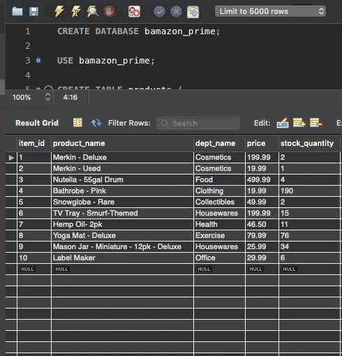

# bamazon-prime
Week 12 Homework **"Bamazon"**

## Why Bamazon?
Bamazon is a great (if not obtuse?) example of using node.js to connect to MySql to pull, display, and manipulate data. CLI CRUD at its CRUDDIEST!

## Functionality Display

Simply input "node bamazonCustomer.js" into the command line, then prepare yourself to shop:

Next up: a brief display of the updated database--be sure to keep your eyes on Row 8's Stock Quantity!

